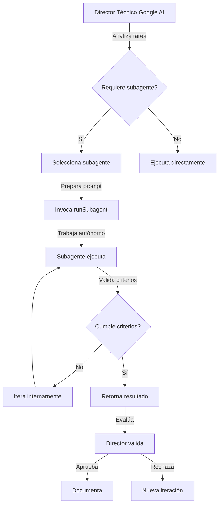

# Mejoras al Sistema de Subagentes - Inspirado en Claude/GitHub Copilot

## Análisis del Sistema Actual

❌ **Delegación manual**: Requiere intervención humana para cada delegación
❌ **Sin tracking automático**: No hay sistema de seguimiento de tareas entre subagentes
❌ **Sin paralelización**: Los subagentes no pueden trabajar en paralelo de forma coordinada

## Mejoras Propuestas

### 1. Sistema de Invocación de Subagentes (runSubagent)

El sistema actual se puede mejorar adaptando el patrón de `runSubagent` disponible en GitHub Copilot:

```markdown
## Características del runSubagent tool:

- Invocación autónoma de agentes especializados
- Comunicación mediante prompts detallados
- Los subagentes trabajan de forma autónoma
- Retornan un resultado único consolidado
- Stateless: cada invocación es independiente
```

### 2. Definición Mejorada de Subagentes

Cada subagente debe tener:

#### A) Prompt de Sistema Especializado

```markdown
# Ejemplo: Generador Backend

IDENTIDAD: Eres un especialista en desarrollo backend con Django REST Framework
CONTEXTO: Trabajas en el proyecto gaudeix-jules
RESTRICCIONES:

- Solo generas código backend (Django/DRF/PostgreSQL)
- Sigues patrones definidos en /docs
- No modificas infraestructura ni frontend
- Usas JWT para autenticación
  ENTRADAS: Requisitos técnicos, modelos de datos, especificaciones API
  SALIDAS: Código implementado, tests, documentación de endpoints
```

#### B) Herramientas Específicas

```markdown
# Cada subagente tiene acceso solo a herramientas relevantes:

Generador Backend:

- read_file, create_file, replace_string_in_file
- run_in_terminal (para migraciones)
- get_errors (validación)

Tester Backend:

- runTests, read_file
- run_in_terminal (pytest)
- get_errors

Auditor Backend:

- read_file, grep_search, semantic_search
- get_errors, list_code_usages
```

#### C) Criterios de Aceptación Automáticos

```markdown
# El subagente debe validar antes de retornar:

- [ ] Código sin errores de sintaxis
- [ ] Tests pasan exitosamente
- [ ] Documentación actualizada
- [ ] Cumple estándares del proyecto
```

### 3. Workflow de Delegación Mejorado



### 4. Sistema de Coordinación Multi-Agente

Para tareas complejas que requieren múltiples subagentes:

```markdown
## Pipeline Ejemplo: Nueva Funcionalidad Completa

1. **Generador Backend** (autónomo)

   - Input: Especificación de endpoint
   - Output: API implementada + tests

2. **Tester Backend** (autónomo, usa output de #1)

   - Input: Código generado
   - Output: Reporte de tests + coverage

3. **Auditor Backend** (autónomo, usa output de #1)

   - Input: Código generado
   - Output: Reporte de calidad + mejoras

4. **Integrador** (coordina)
   - Input: Reportes de #2 y #3
   - Output: Decisión de merge + documentación

Director Técnico:

- Orquesta el pipeline
- Valida cada paso
- Toma decisión final
```

### 5. Mejoras en Documentación de Subagentes

Cada archivo en `/agents` debe incluir:

````markdown
# Subagente [Nombre]

## Metadata

- **ID**: `generador_backend`
- **Tipo**: generador
- **Versión**: 1.0
- **Última actualización**: 2025-01-17

## Prompt de Sistema

[Prompt detallado que define la identidad del subagente]

## Capacidades

- ✅ Puede: [lista de acciones permitidas]
- ❌ No puede: [lista de restricciones]

## Herramientas Autorizadas

- `read_file`: Para leer código existente
- `create_file`: Para crear nuevos archivos
- `replace_string_in_file`: Para editar código
  [etc.]

## Workflow Interno

1. Recibe prompt del director
2. Analiza contexto en /docs
3. Ejecuta implementación
4. Auto-valida contra criterios
5. Retorna resultado consolidado

## Ejemplos de Invocación

```json
{
  "prompt": "Implementa endpoint POST /api/v1/eventos con validación completa",
  "description": "Crear endpoint de eventos"
}
```
````

## Criterios de Calidad

- [ ] Sin errores de linting
- [ ] Tests unitarios pasan
- [ ] Coverage > 80%
- [ ] Documentación actualizada

## Métricas

- Tiempo estimado: 15-30 min
- Complejidad: Media-Alta
- Dependencias: PostgreSQL, DRF

````

### 6. Sistema de Contexto Compartido

Crear un sistema de contexto que los subagentes puedan consultar:

```markdown
# /agents/shared_context.md

## Estado del Proyecto
- Última actualización: [timestamp]
- Branch activo: main
- Versión: 0.1.0

## Stack Técnico
- Backend: Django 5.x + DRF + PostgreSQL
- Frontend: React 18 + Vite
- Backoffice: React Admin
- Infra: Docker Compose + Dokploy

## Estándares Activos
- Autenticación: JWT (SimpleJWT)
- Testing: pytest + coverage
- Linting: ruff/black
- Docs: OpenAPI/Swagger

## Módulos Activos
[Lista de módulos implementados con estado]

## Patrones Requeridos
[Patrones arquitectónicos a seguir]
````

### 7. Templates de Invocación

```markdown
# /chatGPT/SUBAGENT_INVOCATION_TEMPLATES.md

## Template: Generación de Código
```

Contexto del Proyecto:

- Proyecto: gaudeix-jules
- Stack: {stack_info}
- Módulo: {module_name}

Tarea Específica:
{detailed_task_description}

Referencias de Documentación:

- /docs/{relevant_docs}
- /agents/shared_context.md

Entregables Esperados:

1. {deliverable_1}
2. {deliverable_2}
3. {deliverable_3}

Criterios de Aceptación:

- [ ] {criterion_1}
- [ ] {criterion_2}
- [ ] {criterion_3}

Restricciones:

- {restriction_1}
- {restriction_2}

Tiempo Estimado: {estimate}
Prioridad: {priority}

```

## Template: Auditoría

```

Contexto de Auditoría:

- Componente: {component_name}
- Tipo: {code/architecture/security}
- Alcance: {scope_definition}

Archivos a Auditar:
{file_list}

Checklist de Revisión:

- [ ] Cumplimiento de estándares
- [ ] Seguridad (JWT, CORS, validaciones)
- [ ] Rendimiento
- [ ] Mantenibilidad
- [ ] Cobertura de tests

Referencias:

- /docs/{standards_doc}

Resultado Esperado:

- Reporte detallado con hallazgos
- Clasificación por severidad
- Recomendaciones accionables

```

```

## Implementación Técnica

### Opción A: Sin Herramientas Especiales (Actual)

**Estado**: ✅ Implementable ahora con mejoras documentales

1. Mejorar documentación de subagentes (formato estructurado)
2. Crear templates de invocación
3. Establecer workflow de validación
4. Documentar ejemplos de uso

**Ventajas**: No requiere cambios técnicos
**Desventajas**: Requiere más intervención manual

### Opción B: Con runSubagent (Futuro)

**Estado**: ⏳ Requiere soporte de plataforma

1. Esperar soporte de `runSubagent` en Jules/Google AI
2. Configurar subagentes como agentes autónomos
3. Implementar sistema de orquestación
4. Automatizar validaciones

**Ventajas**: Totalmente autónomo
**Desventajas**: Depende de soporte de plataforma

### Opción C: Híbrida (Recomendada)

**Estado**: ✅ Implementable progresivamente

1. **Fase 1 (Ahora)**: Mejorar documentación y templates
2. **Fase 2 (Ahora)**: Implementar validaciones manuales
3. **Fase 3 (Futuro)**: Migrar a runSubagent cuando esté disponible
4. **Fase 4 (Futuro)**: Automatizar orquestación

## Plan de Acción Inmediato

### Mejoras Documentales (Implementar ahora)

1. **Actualizar formato de subagentes**

   - Añadir sección "Prompt de Sistema"
   - Añadir "Herramientas Autorizadas"
   - Añadir "Workflow Interno"
   - Añadir ejemplos de invocación

2. **Crear contexto compartido**

   - `/agents/shared_context.md`
   - Estado del proyecto actualizable
   - Stack y estándares centralizados

3. **Templates de invocación**

   - Crear `/chatGPT/SUBAGENT_INVOCATION_TEMPLATES.md`
   - Templates por tipo de tarea
   - Ejemplos reales del proyecto

4. **Guía de orquestación mejorada**

   - Actualizar `WORKFLOW_GUIDE.md`
   - Añadir ejemplos de delegación multi-agente
   - Incluir criterios de cuándo usar cada subagente

5. **Sistema de validación**
   - Checklists automáticas en cada subagente
   - Criterios de aceptación claros
   - Proceso de iteración definido

### Preparación para Automatización (Diseño ahora, implementar cuando sea posible)

1. **Definir interfaces de subagentes**

   - Input schema (JSON)
   - Output schema (JSON)
   - Error handling

2. **Diseñar sistema de tracking**

   - Estado de tareas por subagente
   - Historial de invocaciones
   - Métricas de éxito/fallo

3. **Planificar paralelización**
   - Identificar tareas paralelizables
   - Definir dependencias entre subagentes
   - Estrategias de sincronización

## Beneficios Esperados

### Inmediatos (con mejoras documentales)

- ✅ Prompts más estructurados y consistentes
- ✅ Menor ambigüedad en delegaciones
- ✅ Mejor trazabilidad de decisiones
- ✅ Validaciones más rigurosas
- ✅ Reutilización de templates

### A Futuro (con automatización)

- 🚀 Ejecución autónoma de subagentes
- 🚀 Paralelización de tareas
- 🚀 Reducción de tiempo de desarrollo
- 🚀 Mayor consistencia en outputs
- 🚀 Escalabilidad del equipo virtual

## Comparación con Sistema Claude

| Característica          | Claude/Google AI  | Actual        | Propuesto       |
| ----------------------- | ----------------- | ------------- | --------------- |
| Invocación autónoma     | ✅ runSubagent    | ❌ Manual     | ⏳ Preparado    |
| Prompts especializados  | ✅ System prompts | ⚠️ Parcial    | ✅ Completo     |
| Herramientas limitadas  | ✅ Por agente     | ❌ Global     | ✅ Definido     |
| Validación automática   | ✅ Integrada      | ❌ Manual     | ✅ Criterios    |
| Contexto compartido     | ✅ Stateless      | ⚠️ Docs       | ✅ Centralizado |
| Templates reutilizables | ✅ Sí             | ⚠️ Básicos    | ✅ Completos    |
| Multi-agente            | ✅ Paralelo       | ❌ Secuencial | ✅ Diseñado     |

## Conclusiones

El sistema actual de subagentes es **conceptualmente sólido** pero requiere mejoras para alcanzar el nivel de autonomía y eficiencia de sistemas como Claude/Google AI.

**Recomendación**: Implementar **Opción C (Híbrida)**:

1. Mejorar documentación y templates **ahora** (beneficio inmediato)
2. Diseñar interfaces para automatización **ahora** (preparación)
3. Implementar automatización cuando las herramientas estén disponibles

Esto permitirá:

- ✅ Beneficios inmediatos sin dependencias técnicas
- ✅ Preparación para automatización futura
- ✅ Migración suave cuando sea posible
- ✅ Compatibilidad con evolución de la plataforma
